[](https://kgysoft.net)

# KGy SOFT Drawing Libraries

KGy SOFT Drawing Libraries offer advanced bitmap data manipulation and image processing features such as quantizing and dithering. The libraries consist of multiple packages. A core library contains the technology-agnostic and platform independent functionality and there are specialized libraries built upon the core package.

[](https://kgysoft.net/drawing)
[](https://docs.kgysoft.net/drawing)
[](https://github.com/koszeggy/KGySoft.Drawing)
[](https://www.nuget.org/packages/KGySoft.Drawing.Core)
[](https://github.com/koszeggy/KGySoft.Drawing.Tools)

## Table of Contents:
1. [Download](#download)
   - [Available Packages](#available-packages)
   - [Application Examples](#application-examples)
2. [Project Site](#project-site)
3. [Documentation](#documentation)
4. [Release Notes](#release-notes)
5. [Examples](#examples)
   - [Fast Bitmap Manipulation](#fast-bitmap-manipulation)
   - [Fast GetPixel/SetPixel For Any Bitmaps](#fast-getpixelsetpixel-for-any-bitmaps)
   - [Managed Bitmap Data Manipulation](#managed-bitmap-data-manipulation)
   - [3rd Party Bitmap Types Support](#3rd-party-bitmap-types-support)
   - [Supporting Custom Pixel Formats](#supporting-custom-pixel-formats)
   - [Shape Drawing](#shape-drawing)
   - [Color Correct Alpha Blending](#color-correct-alpha-blending)
   - [Quantizing and Dithering](#quantizing-and-dithering)
   - [Advanced GIF Encoder with High Color Support](#advanced-gif-encoder-with-high-color-support)
6. [License](#license)

## Download:

### Available Packages:

Starting with version 7.0.0 KGy SOFT Drawing Libraries are available in multiple packages:

#### [KGySoft.Drawing.Core](https://www.nuget.org/packages/KGySoft.Drawing.Core) [](https://www.nuget.org/packages/KGySoft.Drawing.Core)

This package contains the platform-independent core functionality that mainly resides in the [KGySoft.Drawing.Imaging](https://docs.kgysoft.net/drawing/html/N_KGySoft_Drawing_Imaging.htm) namespace.

Main highlights:
- Creating [managed bitmap data](http://docs.kgysoft.net/drawing/html/T_KGySoft_Drawing_Imaging_BitmapDataFactory.htm) of any pixel format.
- Creating bitmap data for any preallocated buffer using any pixel format. This allows accessing the pixels of bitmaps of any technology if the bitmap data is exposed as a pointer or array.
- Quantizing using [predefined](https://docs.kgysoft.net/drawing/html/T_KGySoft_Drawing_Imaging_PredefinedColorsQuantizer.htm) or [optimized](https://docs.kgysoft.net/drawing/html/T_KGySoft_Drawing_Imaging_OptimizedPaletteQuantizer.htm) colors
- Dithering using [ordered](https://docs.kgysoft.net/drawing/html/T_KGySoft_Drawing_Imaging_OrderedDitherer.htm), [error diffusion](https://docs.kgysoft.net/drawing/html/T_KGySoft_Drawing_Imaging_ErrorDiffusionDitherer.htm), [random noise](https://docs.kgysoft.net/drawing/html/T_KGySoft_Drawing_Imaging_RandomNoiseDitherer.htm) or [interleaved gradient noise](https://docs.kgysoft.net/drawing/html/T_KGySoft_Drawing_Imaging_InterleavedGradientNoiseDitherer.htm) dithering techniques
- Creating [GIF animations](https://docs.kgysoft.net/drawing/html/T_KGySoft_Drawing_Imaging_GifEncoder.htm) even in high color

The package can be downloaded directly from [NuGet](https://www.nuget.org/packages/KGySoft.Drawing.Core) or by using the Package Manager Console:

    PM> Install-Package KGySoft.Drawing.Core

#### [KGySoft.Drawing](https://www.nuget.org/packages/KGySoft.Drawing) [](https://www.nuget.org/packages/KGySoft.Drawing)

This package provides special support for `System.Drawing` types such as `Bitmap`, `Metafile`, `Image`, `Icon`, `Graphics`. In .NET 7 and above this package can be used on Windows only. When targeting earlier versions, Unix/Linux based systems are also supported (if the libgdiplus library is installed).

Main highlights:
- Fast [direct native Bitmap data access](https://docs.kgysoft.net/drawing/html/M_KGySoft_Drawing_BitmapExtensions_GetReadWriteBitmapData.htm) for every PixelFormat
- [Quantizing](https://docs.kgysoft.net/drawing/html/M_KGySoft_Drawing_BitmapExtensions_Quantize.htm) and [dithering](https://docs.kgysoft.net/drawing/html/M_KGySoft_Drawing_BitmapExtensions_Dither.htm)
- Creating [GIF animations](https://docs.kgysoft.net/drawing/html/Overload_KGySoft_Drawing_ImageExtensions_SaveAsAnimatedGif.htm) even in high color
- Several [built-in icons](https://docs.kgysoft.net/drawing/html/T_KGySoft_Drawing_Icons.htm) as well as simple access to Windows associated and stock icons.
- Extracting bitmaps from multi-frame bitmaps and icons.
- Creating combined icons and multi-resolution bitmaps.
- Saving metafiles in EMF/WMF formats.
- Advanced support for saving images as Icon, BMP, JPEG, PNG, GIF and TIFF formats.
- [Converting between various pixel formats](https://docs.kgysoft.net/drawing/html/M_KGySoft_Drawing_ImageExtensions_ConvertPixelFormat.htm) preserving transparency if possible.
- Useful extensions for the [Icon](https://docs.kgysoft.net/drawing/html/T_KGySoft_Drawing_IconExtensions.htm), [Bitmap](https://docs.kgysoft.net/drawing/html/T_KGySoft_Drawing_BitmapExtensions.htm), [Image](https://docs.kgysoft.net/drawing/html/T_KGySoft_Drawing_ImageExtensions.htm), [Metafile](https://docs.kgysoft.net/drawing/html/T_KGySoft_Drawing_MetafileExtensions.htm) and [Graphics](https://docs.kgysoft.net/drawing/html/T_KGySoft_Drawing_GraphicsExtensions.htm) types.

The package can be downloaded directly from [NuGet](https://www.nuget.org/packages/KGySoft.Drawing) or by using the Package Manager Console:

    PM> Install-Package KGySoft.Drawing

#### [KGySoft.Drawing.Wpf](https://www.nuget.org/packages/KGySoft.Drawing.Wpf) [](https://www.nuget.org/packages/KGySoft.Drawing.Wpf)

This package helps accessing the bitmap data of the `WriteableBitmap` type in WPF supporting all of its possible pixel formats. It also allows direct read-only access to the bitmap data of any `BitmapSource`.

Main highlights:
- Fast [direct native WriteableBitmap data access](https://docs.kgysoft.net/drawing/html/M_KGySoft_Drawing_Wpf_WriteableBitmapExtensions_GetReadWriteBitmapData.htm) for every PixelFormat
- [Converting between various pixel formats](https://docs.kgysoft.net/drawing/html/M_KGySoft_Drawing_Wpf_BitmapSourceExtensions_ConvertPixelFormat.htm) with optional dithering.
- Useful extensions for the [BitmapSource](https://docs.kgysoft.net/drawing/html/T_KGySoft_Drawing_Wpf_BitmapSourceExtensions.htm), [Color](https://docs.kgysoft.net/drawing/html/T_KGySoft_Drawing_Wpf_ColorExtensions.htm), [PixelFormat](https://docs.kgysoft.net/drawing/html/T_KGySoft_Drawing_Wpf_PixelFormatExtensions.htm) and [WriteableBitmap](https://docs.kgysoft.net/drawing/html/T_KGySoft_Drawing_Wpf_WriteableBitmapExtensions.htm) types.

The package can be downloaded directly from [NuGet](https://www.nuget.org/packages/KGySoft.Drawing.Wpf) or by using the Package Manager Console:

    PM> Install-Package KGySoft.Drawing.Wpf

#### [KGySoft.Drawing.Uwp](https://www.nuget.org/packages/KGySoft.Drawing.Uwp) [](https://www.nuget.org/packages/KGySoft.Drawing.Uwp)

This package helps accessing the bitmap data of the `WriteableBitmap` type in UWP (Universal Windows Platform). This library requires targeting at least Windows 10.0.16299.0 (Fall Creators Update, version 1709) so it can reference the .NET Standard 2.0 version of the dependent core libraries.

The package can be downloaded directly from [NuGet](https://www.nuget.org/packages/KGySoft.Drawing.Uwp) or by using the Package Manager Console:

    PM> Install-Package KGySoft.Drawing.Uwp

#### [KGySoft.Drawing.WinUI](https://www.nuget.org/packages/KGySoft.Drawing.WinUI) [](https://www.nuget.org/packages/KGySoft.Drawing.WinUI)

This package helps accessing the bitmap data of the `WriteableBitmap` type of the Windows App SDK used in WinUI applications. This library requires targeting at least .NET 5 and Windows 10.0.17763.0 (October 2018 release, version 1809).

The package can be downloaded directly from [NuGet](https://www.nuget.org/packages/KGySoft.Drawing.WinUI) or by using the Package Manager Console:

    PM> Install-Package KGySoft.Drawing.WinUI

#### [KGySoft.Drawing.SkiaSharp](https://www.nuget.org/packages/KGySoft.Drawing.SkiaSharp) [](https://www.nuget.org/packages/KGySoft.Drawing.SkiaSharp)

This package provides dedicated support for the `SKBitmap`, `SKPixmap`, `SKImage` and `SKSurface` types of SkiaSharp. All pixel formats are supported (and [unlike](https://github.com/mono/SkiaSharp/issues/2354) SkiaSharp's own `GetPixel`, `IReadableBitmapData.GetPixel` also works correctly for all pixel formats), though for the fastest direct support the color space should be either sRGB or linear. The library also offers direct [pixel format conversion](https://docs.kgysoft.net/drawing/html/M_KGySoft_Drawing_SkiaSharp_SKBitmapExtensions_ConvertPixelFormat.htm) with optional quantizing and dithering.

The package can be downloaded directly from [NuGet](https://www.nuget.org/packages/KGySoft.Drawing.SkiaSharp) or by using the Package Manager Console:

    PM> Install-Package KGySoft.Drawing.SkiaSharp

### Application Examples

#### KGy SOFT Drawing Example Applications

See the [Examples](Examples) folder for example applications for using KGy SOFT Drawing Libraries in various environments such as [MAUI](Examples/SkiaSharp_(Maui)), [UWP](Examples/Uwp), [WinForms](Examples/WinForms), [WinUI](Examples/WinUI), [WPF](Examples/Wpf) and [Xamarin](Examples/Xamarin).

<p align="center">
  <a href="Examples/Maui"></a>
  <br/><em>KGy SOFT Drawing MAUI Example App running on Android Phone.
  <br/>See the <a href="Examples">Examples</a> folder for all of the example applications.</em>
</p>

#### KGy SOFT Imaging Tools and Debugger Visualizers:

[KGy SOFT Imaging Tools](https://github.com/koszeggy/KGySoft.Drawing.Tools/#kgy-soft-imaging-tools) is a Windows Forms desktop application in the [KGySoft.Drawing.Tools](https://github.com/koszeggy/KGySoft.Drawing.Tools) repository, which nicely demonstrates a sort of features of Drawing Libraries, such as quantizing and dithering, resizing, adjusting brightness, contrast and gamma, etc. The tool is packed also with some debugger visualizers for several `System.Drawing`, `WPF`, `SkiaSharp` and `KGySoft` types including `Bitmap`, `Metafile`, `Icon`, `Graphics`, `WriteableBitmap`, `SKBitmap` and more.

<p align="center">
  <a href="https://github.com/koszeggy/KGySoft.Drawing.Tools"></a>
  <br/><em>KGy SOFT Imaging Tools</em>
</p>

#### ScreenToGif

[ScreenToGif](https://github.com/NickeManarin/ScreenToGif) is a WPF desktop application that can be used to create and save animations. Among others, it can use KGy SOFT Drawing Libraries to save GIF animations using various quantizers and ditherers.

<p align="center">
  
  <br/><em>KGy SOFT GIF encoder options in ScreenToGif</em>
</p>

## Project Site

Find the project site at [kgysoft.net](https://kgysoft.net/drawing/)

## Documentation

* You can find the online KGy SOFT Drawing Libraries documentation [here](https://docs.kgysoft.net/drawing). Please note that it refers to the combined documentation of the available [packages](#available-packages). Check the indicated **Assembly** at the help pages that also designates the corresponding package.

* See [this](https://docs.kgysoft.net) link to access the online documentation of all KGy SOFT libraries.

## Release Notes

* [KGySoft.Drawing.Core change log](https://github.com/koszeggy/KGySoft.Drawing/blob/master/KGySoft.Drawing.Core/changelog.txt)
* [KGySoft.Drawing change log](https://github.com/koszeggy/KGySoft.Drawing/blob/master/Specific/GdiPlus/KGySoft.Drawing/changelog.txt)
* [KGySoft.Drawing.Wpf change log](https://github.com/koszeggy/KGySoft.Drawing/blob/master/Specific/Wpf/KGySoft.Drawing.Wpf/changelog.txt)
* [KGySoft.Drawing.Uwp change log](https://github.com/koszeggy/KGySoft.Drawing/blob/master/Specific/Uwp/KGySoft.Drawing.Uwp/changelog.txt)
* [KGySoft.Drawing.WinUI change log](https://github.com/koszeggy/KGySoft.Drawing/blob/master/Specific/WinUI/KGySoft.Drawing.WinUI/changelog.txt)
* [KGySoft.Drawing.SkiaSharp change log](https://github.com/koszeggy/KGySoft.Drawing/blob/master/Specific/SkiaSharp/KGySoft.Drawing.SkiaSharp/changelog.txt)

## Examples

### Fast Bitmap Manipulation
<sub>(This example requires the [KGySoft.Drawing](https://www.nuget.org/packages/KGySoft.Drawing) package for the GDI+ `Bitmap` type but works similarly also for other bitmap types (e.g. `WriteableBitmap` of WPF/UWP/WinUI) you can create an [`IBitmapData`](https://docs.kgysoft.net/drawing/html/T_KGySoft_Drawing_Imaging_IBitmapData.htm) instance for.)</sub>

As it is well known, `Bitmap.SetPixel`/`GetPixel` methods are very slow, and `Bitmap.SetPixel` does not even support every pixel format. A typical solution can be to obtain a `BitmapData` by the `LockBits` method, which has further drawbacks: you need to use unsafe code and pointers, and the way you need to access the bitmap data depends on the actual `PixelFormat` of the bitmap.

KGy SOFT Drawing Libraries offer a very fast and convenient way to overcome these issues. A managed accessor can be obtained by the [`GetReadableBitmapData`](https://docs.kgysoft.net/drawing/html/M_KGySoft_Drawing_BitmapExtensions_GetReadableBitmapData.htm), [`GetWritableBitmapData`](https://docs.kgysoft.net/drawing/html/M_KGySoft_Drawing_BitmapExtensions_GetWritableBitmapData.htm) and [`GetReadWriteBitmapData`](https://docs.kgysoft.net/drawing/html/M_KGySoft_Drawing_BitmapExtensions_GetReadWriteBitmapData.htm) methods:

```cs
var targetFormat = PixelFormat.Format8bppIndexed; // feel free to try other formats as well
using (Bitmap bmpSrc = Icons.Shield.ExtractBitmap(new Size(256, 256)))
using (Bitmap bmpDst = new Bitmap(256, 256, targetFormat))
{
    using (IReadableBitmapData dataSrc = bmpSrc.GetReadableBitmapData())
    using (IWritableBitmapData dataDst = bmpDst.GetWritableBitmapData())
    {
        IReadableBitmapDataRow rowSrc = dataSrc.FirstRow;
        IWritableBitmapDataRow rowDst = dataDst.FirstRow;
        do
        {
            for (int x = 0; x < dataSrc.Width; x++)
                rowDst[x] = rowSrc[x]; // works also between different pixel formats

        } while (rowSrc.MoveNextRow() && rowDst.MoveNextRow());
    }

    bmpSrc.SaveAsPng(@"c:\temp\bmpSrc.png");
    bmpDst.SaveAsPng(@"c:\temp\bmpDst.png"); // or saveAsGif/SaveAsTiff to preserve the indexed format
}
```

> 💡 _Tip:_ See more examples with images at the [`GetReadWriteBitmapData`](https://docs.kgysoft.net/drawing/html/M_KGySoft_Drawing_BitmapExtensions_GetReadWriteBitmapData.htm) extension method.

If you know the actual pixel format you can also access the raw data in a managed way. See the [`IReadableBitmapDataRow.ReadRaw`](https://docs.kgysoft.net/drawing/html/M_KGySoft_Drawing_Imaging_IReadableBitmapDataRow_ReadRaw__1.htm) and [`IWritableBitmapDataRow.WriteRaw`](https://docs.kgysoft.net/drawing/html/M_KGySoft_Drawing_Imaging_IWritableBitmapDataRow_WriteRaw__1.htm) methods for details and examples.

### Fast GetPixel/SetPixel For Any Bitmaps

The previous example showed how to obtain an [`IReadWriteBitmapData`](https://docs.kgysoft.net/drawing/html/T_KGySoft_Drawing_Imaging_IReadWriteBitmapData.htm) for a GDI+ `Bitmap`. But by using the different specific [available packages](#available-packages) the corresponding `GetReadWriteBitmapData` method will be available also for other bitmap types such as `SKBitmap` of [SkiaSharp](https://docs.kgysoft.net/drawing/html/M_KGySoft_Drawing_SkiaSharp_SKBitmapExtensions_GetReadWriteBitmapData.htm), or the `WriteableBitmap` type of [WPF](https://docs.kgysoft.net/drawing/html/M_KGySoft_Drawing_Wpf_WriteableBitmapExtensions_GetReadWriteBitmapData.htm), UWP or [WinUI](https://docs.kgysoft.net/drawing/html/M_KGySoft_Drawing_WinUI_WriteableBitmapExtensions_GetReadWriteBitmapData.htm) platforms offering fast [`GetPixel`](https://docs.kgysoft.net/drawing/html/M_KGySoft_Drawing_Imaging_IReadableBitmapData_GetPixel.htm) and [`SetPixel`](https://docs.kgysoft.net/drawing/html/M_KGySoft_Drawing_Imaging_IWritableBitmapData_SetPixel.htm) methods that are normally not available for a `WiteableBitmap` at all.

### Managed Bitmap Data Manipulation
<sub>(These examples require the [KGySoft.Drawing.Core](https://www.nuget.org/packages/KGySoft.Drawing.Core) package.)</sub>

Not only for the well-known `Bitmap`, `WriteableBitmap` or `SKBitmap` types can you obtain a managed accessor (as described above) but you can also create a completely managed bitmap data instance by the [`BitmapDataFactory`](https://docs.kgysoft.net/drawing/html/T_KGySoft_Drawing_Imaging_BitmapDataFactory.htm) class. See the [`BitmapDataExtensions`](https://docs.kgysoft.net/drawing/html/T_KGySoft_Drawing_Imaging_BitmapDataExtensions.htm) for the available operations on a bitmap data:

```cs
// Creating a completely managed, platform independent bitmap data.
// This overload allocates an internal managed storage.
using var managedBitmapData = BitmapDataFactory.CreateBitmapData(
    new Size(256, 128), KnownPixelFormat.Format32bppArgb);
```

#### Self-allocating vs. Preallocated Buffers

The [`BitmapDataFactory`](https://docs.kgysoft.net/drawing/html/T_KGySoft_Drawing_Imaging_BitmapDataFactory.htm) class has many [`CreateBitmapData`](https://docs.kgysoft.net/drawing/html/Overload_KGySoft_Drawing_Imaging_BitmapDataFactory_CreateBitmapData.htm) overloads. The ones whose first parameter is `Size` allocate the underlying buffer by themselves, which is not directly accessible from outside. But you are also able to use predefined arrays of any primitive element type (one or two dimensional ones), and also [`ArraySection<T>`](https://docs.kgysoft.net/corelibraries/html/T_KGySoft_Collections_ArraySection_1.htm) or [`Array2D<T>`](https://docs.kgysoft.net/corelibraries/html/T_KGySoft_Collections_Array2D_1.htm) buffers to create a managed bitmap data for:

```cs
// interpreting a byte array as 8 bpp grayscale pixels
public static IReadWriteBitmapData GetBitmapData(byte[] pixelBuffer, int width, int height)
{
     // As the result is interpreted as a grayscale image, writing operations
     // such as SetPixel will automatically adjust the colors to a grayscale value
     return BitmapDataFactory.CreateBitmapData(pixelBuffer, new Size(width, height),
         stride: width, // Row size in bytes. For 8 bpp pixels it can be the same as width.
         pixelFormat: KnownPixelFormat.Format8bppIndexed, // Indexed: pixels are palette entries
         palette: Palette.Grayscale256()); // Using a palette of 256 grayscale entries
}
```

### 3rd Party Bitmap Types Support
<sup>(This example requires the [KGySoft.Drawing.Core](https://www.nuget.org/packages/KGySoft.Drawing.Core) package and WPF. Actually you can simply use the [KGySoft.Drawing.Wpf](https://www.nuget.org/packages/KGySoft.Drawing.Wpf) package for WPF.)</sup>

The [`BitmapDataFactory`](https://docs.kgysoft.net/drawing/html/T_KGySoft_Drawing_Imaging_BitmapDataFactory.htm) class has also [`CreateBitmapData`](https://docs.kgysoft.net/drawing/html/Overload_KGySoft_Drawing_Imaging_BitmapDataFactory_CreateBitmapData.htm) overloads to support unmanaged memory. This makes possible to support any bitmap representation that exposes its buffer by a pointer.

For example, this is how you can create a managed accessor for a `WriteableBitmap` instance commonly used in WPF/WinRT/UWP and other XAML-based environments, which expose such a pointer or stream:

> 💡 _Tip:_ In fact, if you use the `WriteableBitmap` of WPF/UWP/WinUI platforms, then you can simply use the [`GetReadWriteBitmapData`](https://docs.kgysoft.net/drawing/html/M_KGySoft_Drawing_Wpf_WriteableBitmapExtensions_GetReadWriteBitmapData.htm) extensions from their corresponding [package](#available-packages). But this is how you can turn a bitmap of any environment into a managed bitmap data that does not have direct support yet.

```cs
// Though naming is different, PixelFormats.Pbgra32 is the same as KnownPixelFormat.Format32bppPArgb.
var bitmap = new WriteableBitmap(width, height, dpiX, dpiY, PixelFormats.Pbgra32, null);

// creating the managed bitmap data for WriteableBitmap:
using (var bitmapData = BitmapDataFactory.CreateBitmapData(
    bitmap.BackBuffer,
    new Size(bitmap.PixelWidth, bitmap.PixelHeight),
    bitmap.BackBufferStride,
    KnownPixelFormat.Format32bppPArgb)
{
    // Do whatever with bitmapData
}

// Actualizing changes. But see also the next example to see how to do these along with disposing.
bitmap.AddDirtyRect(new Int32Rect(0, 0, bitmap.PixelWidth, bitmap.PixelHeight));
bitmap.Unlock();
```

### Supporting Custom Pixel Formats
<sup>(This example requires the [KGySoft.Drawing.Core](https://www.nuget.org/packages/KGySoft.Drawing.Core) package and WPF. Actually you can simply use the [KGySoft.Drawing.Wpf](https://www.nuget.org/packages/KGySoft.Drawing.Wpf) package for WPF.)</sup>

The previous example demonstrated how we can create a managed accessor for a `WriteableBitmap`. But it worked only because we used a pixel format that happens to have built-in support also in KGy SOFT Drawing Libraries. In fact, the libraries provide support for any custom pixel format. The [`CreateBitmapData`](https://docs.kgysoft.net/drawing/html/Overload_KGySoft_Drawing_Imaging_BitmapDataFactory_CreateBitmapData.htm) methods have several overloads that allow you to specify a custom pixel format along with a couple of delegates to be called when pixels are read or written:

```cs
// Though Gray8 format also has built-in support in KGySoft.Drawing.Core
// (see KnownPixelFormat.Format8bppGrayScale) here we pretend as if it was not supported natively.
// So this is our bitmap with the custom pixel format:
var bitmap = new WriteableBitmap(width, height, dpiX, dpiY, PixelFormats.Gray8, null);

// We need to specify a configuration that tells some info about the pixel format
// and how pixels can be got/set from known color formats.
var customConfig = new CustomBitmapDataConfig
{
    PixelFormat = new PixelFormatInfo { BitsPerPixel = 8, Grayscale = true },
    BackBufferIndependentPixelAccess = true,
    BackColor = Color.Silver.ToColor32(), // black if not specified

    // In this example we specify Color32 access but you can use other color types
    // if they fit better for the format (eg. Color64, ColorF or their premultiplied counterparts).
    // Note that the setter blends possible alpha colors with the back color.
    RowGetColor32 = (row, x) => Color32.FromGray(row.UnsafeGetRefAs<byte>(x)),
    RowSetColor32 = (row, x, c) => row.UnsafeGetRefAs<byte>(x) =
        c.Blend(row.BitmapData.BackColor, row.BitmapData.WorkingColorSpace).GetBrightness(),

    // Now we specify also a dispose callback to be executed when the returned instance is disposed:
    DisposeCallback = () =>
    {
        bitmap.AddDirtyRect(new Int32Rect(0, 0, bitmap.PixelWidth, bitmap.PixelHeight));
        bitmap.Unlock();
    }
};

// Returning an IReadWriteBitmapData instance that wraps our native bitmap with the custom format:
return BitmapDataFactory.CreateBitmapData(
    bitmap.BackBuffer, new Size(bitmap.PixelWidth, bitmap.PixelHeight), bitmap.BackBufferStride,
    customConfig); 
```

> 💡 _Tip:_ See also the [Xamarin](Examples/Xamarin) and [MAUI](Examples/Maui) examples that demonstrate [how](https://github.com/koszeggy/KGySoft.Drawing/blob/8ac1a38317660a954ac6cf416c55d1fc3108c2fc/Examples/Maui/Extensions/SKBitmapExtensions.cs#L85) to create a bitmap data for SkiaSharp's `SKBitmap` type as if there was no dedicated package for SkiaSharp.

Note that there are different overloads for indexed formats where you have to specify how to read/write a palette index. Please also note that these delegates work with 32-bit color structures (just like usual `GetPixel`/`SetPixel`) so wider formats will be quantized into the ARGB8888 color space (or BGRA8888, using the alternative terminology) when getting/setting pixels but this is how regular formats work, too. Anyway, you can always access the actual underlying data of whatever format by the aforementioned [`IReadableBitmapDataRow.ReadRaw`](https://docs.kgysoft.net/drawing/html/M_KGySoft_Drawing_Imaging_IReadableBitmapDataRow_ReadRaw__1.htm) and [`IWritableBitmapDataRow.WriteRaw`](https://docs.kgysoft.net/drawing/html/M_KGySoft_Drawing_Imaging_IWritableBitmapDataRow_WriteRaw__1.htm) methods.

### Shape Drawing

KGy SOFT Drawing Libraries offer several extension methods for drawing shapes on bitmaps. It does not matter if you are using a managed bitmap data, a GDI+ `Bitmap`, `WriteableBitmap`, `SKBitmap` or any other bitmap type, the result will be the same for the same pixel formats. Even indexed formats are supported, which usually isn't the case for the native built-in drawing methods of the bitmap types. You can use several brushes and pens to draw or fill shapes with different colors and patterns, and you can use the [`DrawingOptions`](https://docs.kgysoft.net/drawing/html/T_KGySoft_Drawing_Shapes_DrawingOptions.htm) to specify several parameters, such as the quality of the rendering, or even quantizing and dithering.

There are specific methods for drawing rectangles, ellipses, lines, polygons, Bézier-curves, arcs, pies and rounded rectangles, and you can specify paths for more complex compound shapes. The drawing methods are available as extension methods for the `IReadWriteBitmapData` interface (both in sync and async flavors), so you can use them with any bitmap type mentioned above.

The following example demonstrates the possible shape drawing approaches with ellipse drawing:

```cs
// Using a managed bitmap here, but you can also use the GetReadWriteBitmapData
// extension method of the specific libraries.
using var bitmap = BitmapDataFactory.CreateBitmapData(64, 64, KnownPixelFormat.Format32bppArgb);

// Drawing a filled ellipse with an implicit solid brush:
bitmap.FillEllipse(Color.Red, new Rectangle(8, 8, 48, 48));

// Drawing a filled ellipse with an explicit brush:
bitmap.FillEllipse(Brush.CreateSolid(Color.Yellow), new Rectangle(20, 20, 24, 24));

// Drawing an outlined ellipse with an implicit solid 1 pixel width pen:
bitmap.DrawEllipse(Color.Green, new Rectangle(16, 16, 32, 32));

// Drawing an outlined ellipse with an explicit pen:
bitmap.DrawEllipse(new Pen(Color.Blue, 2f), new Rectangle(24, 24, 16, 16));

// Similar as above, but asynchronously:
await bitmap.FillEllipseAsync(Color.Red, new Rectangle(8, 8, 48, 48));
```

#### Path

For more complex shapes, you can use the [`Path`](https://docs.kgysoft.net/drawing/html/T_KGySoft_Drawing_Shapes_Path.htm) class to define a sequence of lines, curves, and other shapes. As it allows caching the path region, you may want to use it also for simple shapes if you plan to draw them multiple times.

The following example demonstrates how to use the `Path` class:

```cs
// It supports flow syntax, so you could even inline it into a Draw/FillPath call:
var path = new Path(false)
    .TransformTranslation(1, 1)
    .AddPolygon(new(50, 0), new(79, 90), new(2, 35), new(97, 35), new(21, 90))
    .AddEllipse(0, 0, 100, 100)
    .AddRoundedRectangle(0, 0, 100, 100, cornerRadius: 10);

// Calculating required the size of the bitmap, adding symmetric padding:
var bounds = path.Bounds;
var size = bounds.Size + new Size(bounds.Location) * 2;

// Or: GetReadWriteBitmapData for a GDI+ bitmap, WPF WriteableBitmap, SKBitmap, etc.
using var bitmapData = BitmapDataFactory.CreateBitmapData(size);
bitmapData.Clear(Color.Cyan);

// Using implicit 1 pixel width solid pen and default drawing options:
bitmapData.DrawPath(Color.Blue, path);
```

#### Drawing Options

The examples above didn't specify the drawing options, so the default values were used. The [`DrawingOptions`](https://docs.kgysoft.net/drawing/html/T_KGySoft_Drawing_Shapes_DrawingOptions.htm) class allows you to specify several parameters for the drawing methods, such as anti-aliasing, alpha blending, fill mode, special handling for drawing thin lines, pixel offset for scanning and paths, and even quantizing and dithering.

The following table demonstrates a few examples of the different drawing options:

| Description | Image Example |
| -- | -- |
| `FillMode = ShapeFillMode.Alternate` (default): When scanning the region of a polygon to be filled, a point is considered to be the part of the polygon if the scanline crosses odd number of lines before reaching the point to be drawn, and is considered not to be the part of the polygon if the scanline crosses even number of lines. This strategy is faster than the `NonZero` mode, though it may produce "holes" when a polygon has self-crossing lines. | |
| `FillMode = ShapeFillMode.NonZero`: It considers the direction of the path segments at each intersection, adding/subtracting one at every clockwise/counterclockwise intersection. The point is considered to be the part of the polygon if the sum is not zero. | |
| `AntiAliasing = false`, `FastThinLines = true` (default): When anti-aliasing is disabled, 1 pixel width paths are drawn in a special way, optimized for performance and accuracy. | 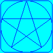|
| `AntiAliasing = false`, `FastThinLines = false`: With disabled `FastThinLines` the 1 pixel width paths are drawn with the same algorithm as wider ones, which may cause a bit jagged appearance. | 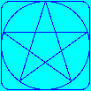|
| `AntiAliasing = true`: When anti-aliasing is enabled, the edges of the shapes are smoothed by blending the colors of the shape and the background. | 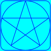|
| `AlphaBlending = true` (default): Possible alpha pixels are blended with the background. The used color space depends on the [`WorkingColorSpace`](https://docs.kgysoft.net/drawing/html/P_KGySoft_Drawing_Imaging_IBitmapData_WorkingColorSpace.htm) of the target bitmap data. In this example the shape is drawn with solid brush, using blue color with 50% transparency, and the bitmap has linear working color space. | 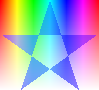|
| `AlphaBlending = false`: Turns off alpha blending. Unless drawing on a transparent background, it's not recommended to combine disabled alpha blending with anti-aliasing, because unexpected alpha pixels may appear at the edges of the shapes. In the example image the brush uses transparent color, which 'cuts' a transparent 'hole' in the image. | 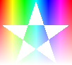|
| `ScanPixelOffset = PixelOffset.None`, `AntiAliasing = false`: When filling shapes, the scanning of edges occurs at the top of the pixels. The shape in the example has integer coordinates, the top edge is descending, whereas the bottom is ascending 1 pixel from the left to the right. The example is enlarged to show the effect. | 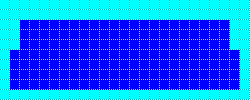|
| `ScanPixelOffset = PixelOffset.Half`, `AntiAliasing = false` (default): The scanning of edges occurs at the center of the pixels. The shape is the same as above. The example is enlarged to show the effect. | 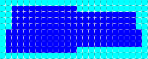|
| `ScanPixelOffset = PixelOffset.None`, `AntiAliasing = true`: When filling shapes, the scanning of edges occurs at the top of the subpixels. When anti-aliasing is enabled, `ScanPixelOffset` makes a much less noticeable difference, though the gradients of the top and bottom lines are a bit different. The example is enlarged to show the effect. | 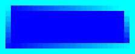|
| `ScanPixelOffset = PixelOffset.Half`, `AntiAliasing = true`: The scanning of edges occurs at the center of the subpixels. The result is almost the same as above, though the gradients of the top and bottom lines are more symmetric. The example is enlarged to show the effect. | 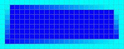|
| `DrawPathPixelOffset = PixelOffset.None` (default): When drawing paths, the point coordinates are not adjusted before applying the pen width. For polygons with every point at integer coordinates, this causes blurry horizontal and vertical lines for odd pen widths and sharp ones for even pen widths. When anti-aliasing is disabled and all points are at integer coordinates, this option makes no difference. The left rectangle was drawn with 1 pixel width pen, and the right one with 2 pixel width pen. | 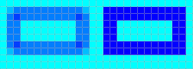|
| `DrawPathPixelOffset = PixelOffset.Half`: The point coordinates are shifted with half pixel right and down before applying the pen width. For polygons with every point at integer coordinates, this causes sharp horizontal and vertical lines for odd pen widths and blurry ones for even pen widths. When anti-aliasing is disabled and all points are at integer coordinates, this option makes no difference. The left rectangle was drawn with 1 pixel width pen, and the right one with 2 pixel width pen. | 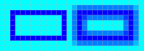|
| `Quantizer` and `Ditherer`: Specifying a quantizer allows drawing shapes with limited number of colors, whereas a ditherer can preserve the tone of the original colors. When drawing into a bitmap with indexed pixel format, quantizing is automatically applied to the colors of the palette. This example is a 1 bit-per-pixel bitmap, the background was cleared with cyan, and the polygon was filled with blue color, and both operation used a [Bayer 8x8 dithering](https://docs.kgysoft.net/drawing/html/P_KGySoft_Drawing_Imaging_OrderedDitherer_Bayer8x8.htm). | 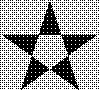|
| `Transformation`: It allows specifying a transformation matrix for the drawing operation. The example demonstrates a simple rotation by 45 degrees from the center. Please note that if a `Path` is drawn multiple times with the same transformation, it's generally recommended to apply the transformation to the `Path` directly rather than to the `DrawingOptions`, because the latter prevents the `Path` region from being cached. | 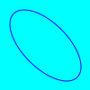|

#### Brushes

The abstract [`Brush`](https://docs.kgysoft.net/drawing/html/T_KGySoft_Drawing_Shapes_Brush.htm) class has several `Create...` factory methods to create different types of brushes. The following table demonstrates a few examples:

| Description | Image Example |
|--|--|
| `Brush.CreateSolid`: Creates a solid brush with a single color. `Color32`, `Color64` and `ColorF` overloads are available, and you can also use the named `Color` members to cast them to `Color32` implicitly. For example, `Brush.CreateSolid(Color32.FromArgb(128, Color.Blue))` creates a blue solid brush with 50% transparency that can produce a similar result to the one in the image. | |
| `Brush.CreateLinearGradient`: Creates a linear gradient brush. There are two groups of overloads: one for specifying a pair of start/end points optionally with some wrapping mode, and another one with an angle, which automatically stretches the gradient for the paths to fill.<br/><br/>The top image uses specific start/end points without repeating the gradient, whereas the bottom one just specified a zero angle to create a horizontal gradient. Note that in the bottom image the start/end points are automatically adjusted to the bounds of the shape in each fill sessions. Both examples filled a single elliptic path with three different translations. | 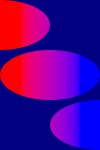<br/>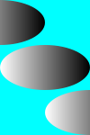|
| `Brush.CreateTexture`: Creates a texture brush. A map mode can be specified, which allows tiling, stretching, centering and a few other modes.<br/><br/>The top image uses a texture with a map mode of tiling with mirroring on both axes, whereas the bottom one centers the same texture and uses no alpha blending, so where there is no texture pixel to set, the path region cuts a transparent hole in the image. Both examples filled a single elliptic path with three different translations. | 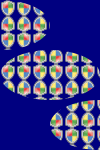<br/>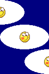|

#### Pens

The [`Pen`](https://docs.kgysoft.net/drawing/html/T_KGySoft_Drawing_Shapes_Pen.htm) class can be instantiated with a brush or a single color, and a width. Some other parameters, such as the start/end cap, the line join and the miter limit can be configured as well. The following table highlights a few properties:

| Description | Image Example |
|--|--|
| `LineJoin`: Specifies how to join the consecutive line segments. Can be `Miter`, `Bevel` or `Round`. The example images demonstrate these join types from the top to the bottom. All examples use a 10 pixel width pen. | <br/><br/>|
| `StartCap` and `EndCap`: Specifies the style of the start and end points of an open figure. Can be `Flat`, `Square`, `Round` or `Triangle`. The example images demonstrate these cap types from the top to the bottom, using the same cap style at both ends. Please note that the only difference between `Flat` and `Square` styles is that the `Flat` style has the originally specified length, whereas the `Square` style extends the line by half of the pen width. All examples use a 10 pixel width pen. | <br/><br/><br/>|
| `Brush`: The pen can be instantiated with a `Brush`, which can be any kind of brushes described above. The example demonstrates a 10 pixel width pen with a diagonal linear gradient brush using mirrored wrapping mode. | 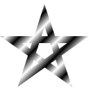|


#### Asynchronous Drawing, Multi-Threading

The basic `Draw...` and `Fill...` methods are synchronous, they automatically adjust the number of used threads, they cannot be canceled and they don't report progress. The overloads with a [`ParallelConfig`](https://docs.kgysoft.net/corelibraries/html/T_KGySoft_Threading_ParallelConfig.htm) parameter are still synchronous, but they allow you to specify the number of threads to be used, and you can also specify a `CancellationToken` to cancel the operation. They also allows you to specify a progress handler to report the progress of the operation.

To draw shapes asynchronously, you can use the `Draw...Async` and `Fill...Async` methods on .NET Framework 4.0 or newer targets, or the old-fashioned `BeginDraw...`/`EndDraw...` and `BeginFill...`/`EndFill...` methods on every target starting with .NET Framework 3.5.

### Color Correct Alpha Blending

Most pixel formats use the sRGB color space, in which alpha blending (and also other operations) may provide incorrect results.

|Description|Image Example|
|--|--|
| Result of blending colors in the sRGB color space. The vertical bars are opaque, whereas the horizontal ones have 50% transparency. Blending colors with disjunct RGB components often produce too dark results. | 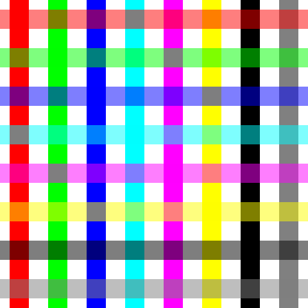 |
| Result of blending colors in the linear color space. The result seems much more natural. Note that horizontal bars still have 50% transparency, though they seem brighter now. | 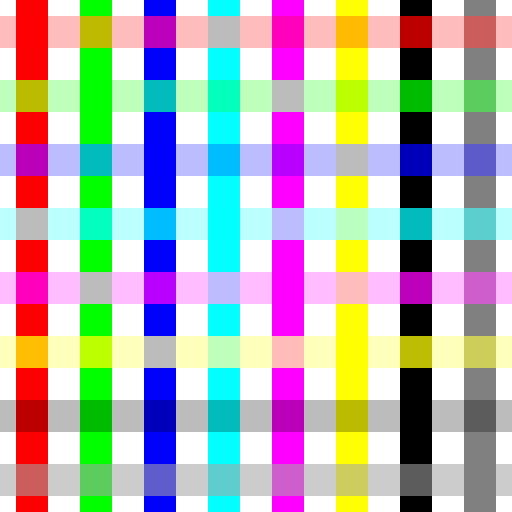 |

By default it depends on the used pixel format which color space is used in KGy SOFT Drawing Libraries. The default pixel format in most rendering engines use some sRGB format (usually a premultiplied one), which is optimized for blending in the sRGB color space. When creating a managed bitmap data by the [`CreateBitmapData`](https://docs.kgysoft.net/drawing/html/Overload_KGySoft_Drawing_Imaging_BitmapDataFactory_CreateBitmapData.htm) overloads or by the `GetReadable/Writable/ReadWriteBitmapData` methods of the specific libraries you can use the overloads that have a [`WorkingColorSpace`](https://docs.kgysoft.net/drawing/html/T_KGySoft_Drawing_Imaging_WorkingColorSpace.htm) parameter.

> 💡 _Tip:_ See the [`WorkingColorSpace`](https://docs.kgysoft.net/drawing/html/T_KGySoft_Drawing_Imaging_WorkingColorSpace.htm) enumeration for more information and image examples about working in the sRGB and linear color spaces.

### Quantizing and Dithering

KGy SOFT Drawing Libraries offer quantizing (reducing the number of colors of an image) and dithering (techniques for preserving the details of a quantized image) in several ways:

* The [`ImageExtensions.ConvertPixelFormat`](https://docs.kgysoft.net/drawing/html/M_KGySoft_Drawing_ImageExtensions_ConvertPixelFormat.htm)/[`BitmapDataExtensions.Clone`](https://docs.kgysoft.net/drawing/html/M_KGySoft_Drawing_Imaging_BitmapDataExtensions_Clone_3.htm) extension methods return new `Bitmap`/[`IReadWriteBitmapData`](https://docs.kgysoft.net/drawing/html/T_KGySoft_Drawing_Imaging_IReadWriteBitmapData.htm) instances as the result of the quantizing/dithering.
* The [`BitmapExtensions.Quantize`](https://docs.kgysoft.net/drawing/html/M_KGySoft_Drawing_BitmapExtensions_Quantize.htm)/[`BitmapDataExtensions.Quantize`](https://docs.kgysoft.net/drawing/html/M_KGySoft_Drawing_Imaging_BitmapDataExtensions_Quantize.htm) and [`BitmapExtensions.Dither`](https://docs.kgysoft.net/drawing/html/M_KGySoft_Drawing_BitmapExtensions_Dither.htm)/[`BitmapDataExtensions.Dither`](https://docs.kgysoft.net/drawing/html/M_KGySoft_Drawing_Imaging_BitmapDataExtensions_Dither.htm) extension methods modify the original `Bitmap`/[`IReadWriteBitmapData`](https://docs.kgysoft.net/drawing/html/T_KGySoft_Drawing_Imaging_IReadWriteBitmapData.htm) instance.
* Some [`ImageExtensions.DrawInto`](https://docs.kgysoft.net/drawing/html/Overload_KGySoft_Drawing_ImageExtensions_DrawInto.htm)/[`BitmapDataExtensions.DrawInto`](https://docs.kgysoft.net/drawing/html/Overload_KGySoft_Drawing_Imaging_BitmapDataExtensions_DrawInto.htm) overloads can use quantizing and dithering when drawing different instances into each other.
* Several further extension methods in the [`BitmapExtensions`](https://docs.kgysoft.net/drawing/html/T_KGySoft_Drawing_BitmapExtensions.htm)/[`BitmapDataExtensions`](https://docs.kgysoft.net/drawing/html/T_KGySoft_Drawing_Imaging_BitmapDataExtensions.htm) classes have an [`IDitherer`](https://docs.kgysoft.net/drawing/html/T_KGySoft_Drawing_Imaging_IDitherer.htm) parameter.

> 💡 _Tip:_
> * For built-in quantizers see the [`PredefinedColorsQuantizer`](https://docs.kgysoft.net/drawing/html/T_KGySoft_Drawing_Imaging_PredefinedColorsQuantizer.htm) and [`OptimizedPaletteQuantizer`](https://docs.kgysoft.net/drawing/html/T_KGySoft_Drawing_Imaging_OptimizedPaletteQuantizer.htm) classes. See their members for code samples and image examples.
> * For built-in ditherers see the [`OrderedDitherer`](https://docs.kgysoft.net/drawing/html/T_KGySoft_Drawing_Imaging_OrderedDitherer.htm), [`ErrorDiffusionDitherer`](https://docs.kgysoft.net/drawing/html/T_KGySoft_Drawing_Imaging_ErrorDiffusionDitherer.htm), [`RandomNoiseDitherer`](https://docs.kgysoft.net/drawing/html/T_KGySoft_Drawing_Imaging_RandomNoiseDitherer.htm) and [`InterleavedGradientNoiseDitherer`](https://docs.kgysoft.net/drawing/html/T_KGySoft_Drawing_Imaging_InterleavedGradientNoiseDitherer.htm) classes. See their members for code samples and image examples.

See the following table for the possible results (click the images for displaying in full size):

|Description|Image Example|
|--|--|
| Original image: Color hues with alpha gradient |  |
| Color hues quantized with [custom 8 color palette](https://docs.kgysoft.net/drawing/html/M_KGySoft_Drawing_Imaging_PredefinedColorsQuantizer_FromCustomPalette_1.htm) and silver background, no dithering. The bottom part turns white because white is the nearest color to silver. |  |
| Color hues quantized with [custom 8 color palette](https://docs.kgysoft.net/drawing/html/M_KGySoft_Drawing_Imaging_PredefinedColorsQuantizer_FromCustomPalette_1.htm) and silver background, using [Bayer 8x8 dithering](https://docs.kgysoft.net/drawing/html/P_KGySoft_Drawing_Imaging_OrderedDitherer_Bayer8x8.htm) |  |
| Original image: Grayscale color shades |  |
| Grayscale color shades quantized with [black and white palette](https://docs.kgysoft.net/drawing/html/M_KGySoft_Drawing_Imaging_PredefinedColorsQuantizer_BlackAndWhite.htm), no dithering | 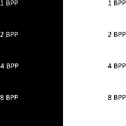 |
| Grayscale color shades quantized with [black and white palette](https://docs.kgysoft.net/drawing/html/M_KGySoft_Drawing_Imaging_PredefinedColorsQuantizer_BlackAndWhite.htm), using [blue noise dithering](https://docs.kgysoft.net/drawing/html/P_KGySoft_Drawing_Imaging_OrderedDitherer_BlueNoise.htm) | 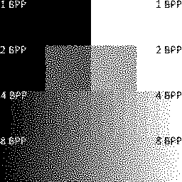 |
| Original test image "Girl with a Pearl Earring" | 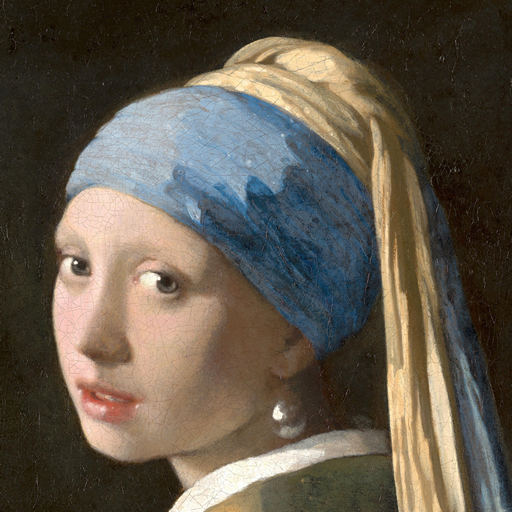 |
| Test image "Girl with a Pearl Earring" quantized with [system default 8 BPP palette](https://docs.kgysoft.net/drawing/html/M_KGySoft_Drawing_Imaging_PredefinedColorsQuantizer_SystemDefault8BppPalette.htm), no dithering |  |
| Test image "Girl with a Pearl Earring" quantized with [system default 8 BPP palette](https://docs.kgysoft.net/drawing/html/M_KGySoft_Drawing_Imaging_PredefinedColorsQuantizer_SystemDefault8BppPalette.htm) using [Bayer 8x8 dithering](https://docs.kgysoft.net/drawing/html/P_KGySoft_Drawing_Imaging_OrderedDitherer_Bayer8x8.htm) |  |
| Test image "Girl with a Pearl Earring" quantized with [system default 8 BPP palette](https://docs.kgysoft.net/drawing/html/M_KGySoft_Drawing_Imaging_PredefinedColorsQuantizer_SystemDefault8BppPalette.htm) using [Floyd-Steinberg dithering](https://docs.kgysoft.net/drawing/html/P_KGySoft_Drawing_Imaging_ErrorDiffusionDitherer_FloydSteinberg.htm) | 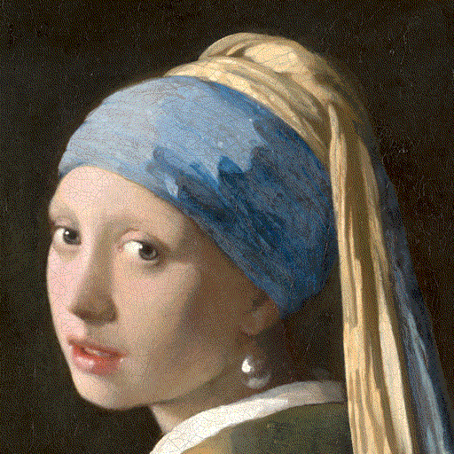 |
| Original test image "Cameraman" |  |
| Test image "Cameraman" quantized with [black and white palette](https://docs.kgysoft.net/drawing/html/M_KGySoft_Drawing_Imaging_PredefinedColorsQuantizer_BlackAndWhite.htm), no dithering |  |
| Test image "Cameraman" quantized with [black and white palette](https://docs.kgysoft.net/drawing/html/M_KGySoft_Drawing_Imaging_PredefinedColorsQuantizer_BlackAndWhite.htm) using [Floyd-Steinberg dithering](https://docs.kgysoft.net/drawing/html/P_KGySoft_Drawing_Imaging_ErrorDiffusionDitherer_FloydSteinberg.htm) | 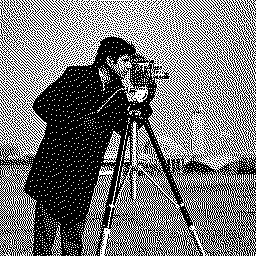 |

> 💡 _Tip:_
> Use  `KGy SOFT Imaging Tools` from the [KGySoft.Drawing.Tools](https://github.com/koszeggy/KGySoft.Drawing.Tools) repository to try image quantization and dithering in a real application. See also the [Examples](Examples) folder for example applications in vairous environments.

<p align="center">
  <a href="https://github.com/koszeggy/KGySoft.Drawing.Tools"></a>
  <br/><em>Quantizing and Dithering in KGy SOFT Imaging Tools</em>
</p>

### Advanced GIF Encoder with High Color Support

The KGy SOFT Drawing Libraries make possible creating high quality GIF images and animations:
* For `Image` types the simplest and highest-level access is provided by the [`ImageExtension`](https://docs.kgysoft.net/drawing/html/T_KGySoft_Drawing_ImageExtensions.htm) class and its `SaveAs*` methods.
* Alternatively, you can use the static methods of the [`GifEncoder`](https://docs.kgysoft.net/drawing/html/T_KGySoft_Drawing_Imaging_GifEncoder.htm) class to create animations or even high color still images. See also the [`AnimatedGifConfiguration`](https://docs.kgysoft.net/drawing/html/T_KGySoft_Drawing_Imaging_AnimatedGifConfiguration.htm) class.
* To create a GIF image or animation completely manually you can instantiate the [`GifEncoder`](https://docs.kgysoft.net/drawing/html/T_KGySoft_Drawing_Imaging_GifEncoder.htm) class that provides you the lowest-level access.

#### Examples:

|Description|Image Example|
|--|--|
| True color GIF animation. The last frame has 29,731 colors. The Granger Rainbow has been generated from an alpha gradient bitmap by [this code](https://github.com/koszeggy/KGySoft.Drawing/blob/9157c58a24f29174e3475f89d0990a28f81691aa/KGySoft.Drawing.UnitTest/UnitTests/Imaging/GifEncoderTest.cs#L693). |  |
| Warning icon encoded as a high color GIF. It has only single bit transparency but otherwise its colors have been preserved. It consists of 18 layers and has 4,363 colors. | 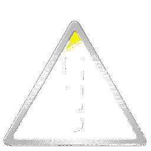 |
| Test image "Lena" encoded as a high color GIF. Before encoding it was prequantized with [RGB565 16-bit quantizer](https://docs.kgysoft.net/drawing/html/M_KGySoft_Drawing_Imaging_PredefinedColorsQuantizer_Rgb565.htm) using [Floyd-Steinberg dithering](https://docs.kgysoft.net/drawing/html/P_KGySoft_Drawing_Imaging_ErrorDiffusionDitherer_FloydSteinberg.htm). It consists of 18 layers and has 4,451 colors. The file size is about 80% of the original [PNG encoded version](Help/Images/Lena.png) but could be even smaller without the dithering. |  |

> ⚠️ _Note:_ Please note that multi layered high color GIF images might be mistakenly rendered as animations by some decoders, including browsers. Still images do not contain the Netscape application extension and do not have any delays. Such images are processed properly by GDI+ on Windows, by the `System.Drawing.Bitmap` and `Image` classes and applications relying on GDI+ decoders such as Windows Paint or [KGy SOFT Imaging Tools](https://github.com/koszeggy/KGySoft.Drawing.Tools/#kgy-soft-imaging-tools).

## License
This repository is under the [KGy SOFT License 1.0](https://github.com/koszeggy/KGySoft.Drawing/blob/master/LICENSE), which is a permissive GPL-like license. It allows you to copy and redistribute the material in any medium or format for any purpose, even commercially. The only thing is not allowed is to distribute a modified material as yours: though you are free to change and re-use anything, do that by giving appropriate credit. See the [LICENSE](https://github.com/koszeggy/KGySoft.Drawing/blob/master/LICENSE) file for details.
