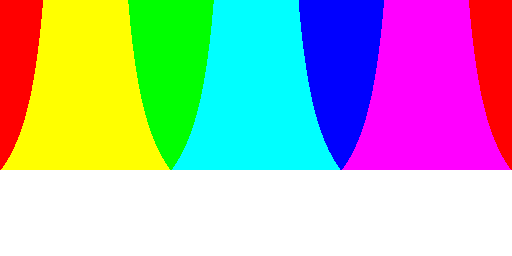
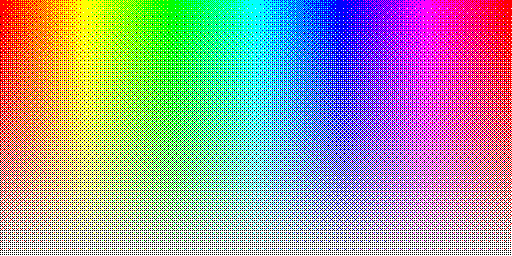
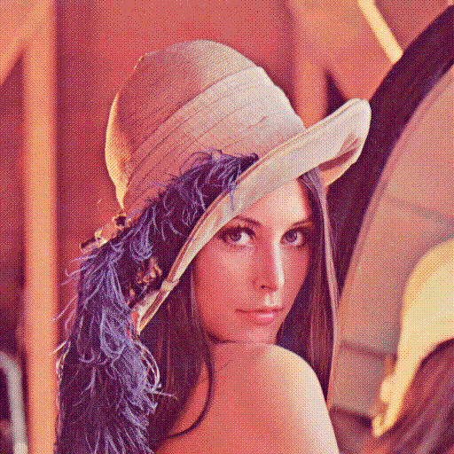

[](https://kgysoft.net)

# KGy SOFT Drawing Libraries

KGy SOFT Drawing Libraries offer advanced drawing features both for completely managed bitmap data as well as native System.Drawing types on multiple platforms.
Multiple versions of .NET Framework and .NET Core are supported. Tested on Windows and Linux (both in Mono and .NET Core environments).

[](https://kgysoft.net/drawing)
[](https://docs.kgysoft.net/drawing)
[](https://github.com/koszeggy/KGySoft.Drawing)
[](https://www.nuget.org/packages/KGySoft.Drawing)
[](https://github.com/koszeggy/KGySoft.Drawing.Tools)

## Table of Contents:
1. [Download](#download)
   - [Download Binaries](#download-binaries)
   - [Download Demo App and Debugger Visualizers](#download-demo-app-and-debugger-visualizers)
2. [Project Site](#project-site)
3. [Documentation](#documentation)
4. [Release Notes](#release-notes)
5. [Examples](#examples)
   - [Icon Manipulation](#icon-manipulation)
   - [Fast Bitmap Manipulation](#fast-bitmap-manipulation)
   - [Managed Bitmap Data Manipulation](#managed-bitmap-data-manipulation)
   - [Quantizing and Dithering](#quantizing-and-dithering)
6. [License](#license)

## Download:

### Download Binaries:

The binaries can be downloaded as a NuGet package directly from [nuget.org](https://www.nuget.org/packages/KGySoft.Drawing)

However, the preferred way is to install the package in VisualStudio either by looking for the `KGySoft.Drawing` package in the Nuget Package Manager GUI, or by sending the following command at the Package Manager Console prompt:

    PM> Install-Package KGySoft.Drawing

### Download Demo App and Debugger Visualizers:

[KGySoft.Drawing.Tools](https://github.com/koszeggy/KGySoft.Drawing.Tools) is another GitHub repository, which contains a couple of applications built on KGy SOFT Drawing Libraries along with debugger visualizers for several `System.Drawing` types including `Bitmap`, `Metafile`, `Icon`, `Graphics` and more.


## Project Site

Find the project site at [kgysoft.net](https://kgysoft.net/drawing/)

## Documentation

* [Online documentation](https://docs.kgysoft.net/drawing)
* [Offline .chm documentation](https://github.com/koszeggy/KGySoft.Drawing/raw/master/KGySoft.Drawing/Help/KGySoft.Drawing.chm)

## Release Notes

See the [change log](https://github.com/koszeggy/KGySoft.Drawing/blob/master/KGySoft.Drawing/changelog.txt).

## Examples

### Icon Manipulation

Icon images of different resolutions and color depth can be extracted from an `Icon`, whereas `Bitmap` and `Icon` instances can be combined into a new `Icon`. PNG compressed icons are also supported.

```cs
// extracting the 256x256 image from an icon:
Bitmap bmp = Icons.Information.ExtractBitmap(new Size(256, 256));

// combining an existing icon with a bitmap:
Icon combined = myIcon.Combine(bmp);
```

> _Tip:_ See more details at the [Icons](https://docs.kgysoft.net/drawing/?topic=html/T_KGySoft_Drawing_Icons.htm) and [IconExtensions](https://docs.kgysoft.net/drawing/?topic=html/T_KGySoft_Drawing_IconExtensions.htm) classes.

### Fast Bitmap Manipulation

As it is well known, `Bitmap.SetPixel`/`GetPixel` methods are very slow. Additionally, they do not support every pixel format. A typical solution can be to obtain a `BitmapData` by the `LockBits` method, which has further drawbacks: you need to use unsafe code and pointers, and the way you need to access the bitmap data depends on the actual `PixelFormat` of the bitmap.

KGy SOFT Drawing Libraries offer very fast and convenient way to overcome these issues. A managed accessor can be obtained by the [`GetReadableBitmapData`](https://docs.kgysoft.net/drawing/?topic=html/M_KGySoft_Drawing_BitmapExtensions_GetReadableBitmapData.htm), [`GetWritableBitmapData`](https://docs.kgysoft.net/drawing/?topic=html/M_KGySoft_Drawing_BitmapExtensions_GetWritableBitmapData.htm) and [`GetReadWriteBitmapData`](https://docs.kgysoft.net/drawing/?topic=html/M_KGySoft_Drawing_BitmapExtensions_GetReadWriteBitmapData.htm) methods:

```cs
var targetFormat = PixelFormat.Format8bppIndexed; // feel free to try other formats as well
using (Bitmap bmpSrc = Icons.Shield.ExtractBitmap(new Size(256, 256)))
using (Bitmap bmpDst = new Bitmap(256, 256, targetFormat))
{
    using (IReadableBitmapData dataSrc = bmpSrc.GetReadableBitmapData())
    using (IWritableBitmapData dataDst = bmpDst.GetWritableBitmapData())
    {
        IReadableBitmapDataRow rowSrc = dataSrc.FirstRow;
        IWritableBitmapDataRow rowDst = dataDst.FirstRow;
        do
        {
            for (int x = 0; x < dataSrc.Width; x++)
                rowDst[x] = rowSrc[x]; // works also between different pixel formats

        } while (rowSrc.MoveNextRow() && rowDst.MoveNextRow());
    }

    bmpSrc.SaveAsPng(@"c:\temp\bmpSrc.png");
    bmpDst.SaveAsPng(@"c:\temp\bmpDst.png"); // or saveAsGif/SaveAsTiff to preserve the indexed format
}
```

> _Tip:_ See more examples with image examples at the [`GetReadWriteBitmapData`](https://docs.kgysoft.net/drawing/?topic=html/M_KGySoft_Drawing_BitmapExtensions_GetReadWriteBitmapData.htm) extension method.

If you know the actual pixel format you can also access the raw data in a managed way. See the [`IReadableBitmapDataRow.ReadRaw`](https://docs.kgysoft.net/drawing/?topic=html/M_KGySoft_Drawing_Imaging_IReadableBitmapDataRow_ReadRaw__1.htm) and [`IWritableBitmapDataRow.WriteRaw`](https://docs.kgysoft.net/drawing/?topic=html/M_KGySoft_Drawing_Imaging_IWritableBitmapDataRow_WriteRaw__1.htm) method for details and examples.

### Managed Bitmap Data Manipulation

Not only for the native `Bitmap` type can you obtain a managed accessor (as described above) but you can also create a completely managed bitmap data instance by the [BitmapDataFactory](https://docs.kgysoft.net/drawing/?topic=html/T_KGySoft_Drawing_Imaging_BitmapDataFactory.htm) class. There are more benefits of using managed bitmap data: not just that they don't use any GDI or other native resources but also that they support every `PixelFormat` on any platform. See the [`BitmapDataExtensions`](https://docs.kgysoft.net/drawing/?topic=html/T_KGySoft_Drawing_Imaging_BitmapDataExtensions.htm) for the available operations on bitmap data where bitmap data can be either a managed one or a managed accessor to a native `Bitmap` instance.

### Quantizing and Dithering

KGy SOFT Drawing Libraries offer quantizing (reducing the number of colors on an image) and dithering (techniques for preserving the details of a quantized image) in several ways:

* The [`ImageExtensions.ConvertPixelFormat`](https://docs.kgysoft.net/drawing/?topic=html/M_KGySoft_Drawing_ImageExtensions_ConvertPixelFormat.htm)/[`BitmapDataExtensions.Clone`](https://docs.kgysoft.net/drawing/?topic=html/M_KGySoft_Drawing_Imaging_BitmapDataExtensions_Clone_3.htm) extension methods return new `Bitmap`/[`IReadWriteBitmapData`](https://docs.kgysoft.net/drawing/?topic=html/T_KGySoft_Drawing_Imaging_IReadWriteBitmapData.htm) instances as the result of the quantizing/dithering.
* The [`BitmapExtensions.Quantize`](https://docs.kgysoft.net/drawing/?topic=html/M_KGySoft_Drawing_BitmapExtensions_Quantize.htm)/[`BitmapDataExtensions.Quantize`](https://docs.kgysoft.net/drawing/?topic=html/M_KGySoft_Drawing_Imaging_BitmapDataExtensions_Quantize.htm) and [`BitmapExtensions.Dither`](https://docs.kgysoft.net/drawing/?topic=html/M_KGySoft_Drawing_BitmapExtensions_Dither.htm)/[`BitmapDataExtensions.Dither`](https://docs.kgysoft.net/drawing/?topic=html/M_KGySoft_Drawing_Imaging_BitmapDataExtensions_Dither.htm) extension methods modify the original `Bitmap`/[`IReadWriteBitmapData`](https://docs.kgysoft.net/drawing/?topic=html/T_KGySoft_Drawing_Imaging_IReadWriteBitmapData.htm) instance.
* Some [`ImageExtensions.DrawInto`](https://docs.kgysoft.net/drawing/?topic=html/Overload_KGySoft_Drawing_ImageExtensions_DrawInto.htm)/[`BitmapDataExtensions.DrawInto`](https://docs.kgysoft.net/drawing/?topic=html/Overload_KGySoft_Drawing_Imaging_BitmapDataExtensions_DrawInto.htm) overloads can use quantizing and dithering when drawing different instances into each other.
* Several further extension methods in the [`BitmapExtensions`](https://docs.kgysoft.net/drawing/?topic=html/T_KGySoft_Drawing_BitmapExtensions.htm)/[`BitmapDataExtensions`](https://docs.kgysoft.net/drawing/?topic=html/T_KGySoft_Drawing_Imaging_BitmapDataExtensions.htm) classes have an [`IDitherer`](https://docs.kgysoft.net/drawing/?topic=html/T_KGySoft_Drawing_Imaging_IDitherer.htm) parameter.

> _Tip:_
> * For built-in quantizers see the [`PredefinedColorsQuantizer`](https://docs.kgysoft.net/drawing/?topic=html/T_KGySoft_Drawing_Imaging_PredefinedColorsQuantizer.htm) and [`OptimizedPaletteQuantizer`](https://docs.kgysoft.net/drawing/?topic=html/T_KGySoft_Drawing_Imaging_OptimizedPaletteQuantizer.htm) classes. See their members for code samples and image examples.
> * For built-in ditherers see the [`OrderedDitherer`](https://docs.kgysoft.net/drawing/?topic=html/T_KGySoft_Drawing_Imaging_OrderedDitherer.htm), [`ErrorDiffusionDitherer`](https://docs.kgysoft.net/drawing/?topic=html/T_KGySoft_Drawing_Imaging_ErrorDiffusionDitherer.htm), [`RandomNoiseDitherer`](https://docs.kgysoft.net/drawing/?topic=html/T_KGySoft_Drawing_Imaging_RandomNoiseDitherer.htm) and [`InterleavedGradientNoiseDitherer`](https://docs.kgysoft.net/drawing/?topic=html/T_KGySoft_Drawing_Imaging_InterleavedGradientNoiseDitherer.htm) classes. See their members for code samples and image examples.

See the following table for the possible results (click the images for displaying in full size):

|Description|Image Example|
|--|--|
| Original image: Color hues with alpha gradient |  |
| Color hues quantized with [custom 8 color palette](https://docs.kgysoft.net/drawing/?topic=html/M_KGySoft_Drawing_Imaging_PredefinedColorsQuantizer_FromCustomPalette_1.htm) and silver background, no dithering. The bottom part turns white because white is the nearest color to silver. |  |
| Color hues quantized with [custom 8 color palette](https://docs.kgysoft.net/drawing/?topic=html/M_KGySoft_Drawing_Imaging_PredefinedColorsQuantizer_FromCustomPalette_1.htm) and silver background, using [Bayer 8x8 dithering](https://docs.kgysoft.net/drawing/?topic=html/P_KGySoft_Drawing_Imaging_OrderedDitherer_Bayer8x8.htm) |  |
| Original image: Grayscale color shades |  |
| Grayscale color shades quantized with [black and white palette](https://docs.kgysoft.net/drawing/?topic=html/M_KGySoft_Drawing_Imaging_PredefinedColorsQuantizer_BlackAndWhite.htm), no dithering |  |
| Grayscale color shades quantized with [black and white palette](https://docs.kgysoft.net/drawing/?topic=html/M_KGySoft_Drawing_Imaging_PredefinedColorsQuantizer_BlackAndWhite.htm), using [blue noise dithering](https://docs.kgysoft.net/drawing/?topic=html/P_KGySoft_Drawing_Imaging_OrderedDitherer_BlueNoise.htm) |  |
| Original test image "Lena" |  |
| Test image "Lena" quantized with [system default 8 BPP palette](https://docs.kgysoft.net/drawing/?topic=html/M_KGySoft_Drawing_Imaging_PredefinedColorsQuantizer_SystemDefault8BppPalette.htm), no dithering |  |
| Test image "Lena" quantized with [system default 8 BPP palette](https://docs.kgysoft.net/drawing/?topic=html/M_KGySoft_Drawing_Imaging_PredefinedColorsQuantizer_SystemDefault8BppPalette.htm) using [Bayer 8x8 dithering](https://docs.kgysoft.net/drawing/?topic=html/P_KGySoft_Drawing_Imaging_OrderedDitherer_Bayer8x8.htm) |  |
| Test image "Lena" quantized with [system default 8 BPP palette](https://docs.kgysoft.net/drawing/?topic=html/M_KGySoft_Drawing_Imaging_PredefinedColorsQuantizer_SystemDefault8BppPalette.htm) using [Floyd-Steinberg dithering](https://docs.kgysoft.net/drawing/?topic=html/P_KGySoft_Drawing_Imaging_ErrorDiffusionDitherer_FloydSteinberg.htm) |  |
| Original test image "Cameraman" |  |
| Test image "Cameraman" quantized with [black and white palette](https://docs.kgysoft.net/drawing/?topic=html/M_KGySoft_Drawing_Imaging_PredefinedColorsQuantizer_BlackAndWhite.htm), no dithering |  |
| Test image "Cameraman" quantized with [black and white palette](https://docs.kgysoft.net/drawing/?topic=html/M_KGySoft_Drawing_Imaging_PredefinedColorsQuantizer_BlackAndWhite.htm) using [Floyd-Steinberg dithering](https://docs.kgysoft.net/drawing/?topic=html/P_KGySoft_Drawing_Imaging_ErrorDiffusionDitherer_FloydSteinberg.htm) |  |

> _Tip:_
> Use  `KGy SOFT Imaging Tools` from the [KGySoft.Drawing.Tools](https://github.com/koszeggy/KGySoft.Drawing.Tools) repository to try image quantization and dithering in an application.


## License
This repository is under the [KGy SOFT License 1.0](https://github.com/koszeggy/KGySoft.Drawing/blob/master/LICENSE), which is a permissive GPL-like license. It allows you to copy and redistribute the material in any medium or format for any purpose, even commercially. The only thing is not allowed is to distribute a modified material as yours: though you are free to change and re-use anything, do that by giving appropriate credit. See the [LICENSE](https://github.com/koszeggy/KGySoft.Drawing/blob/master/LICENSE) file for details.
